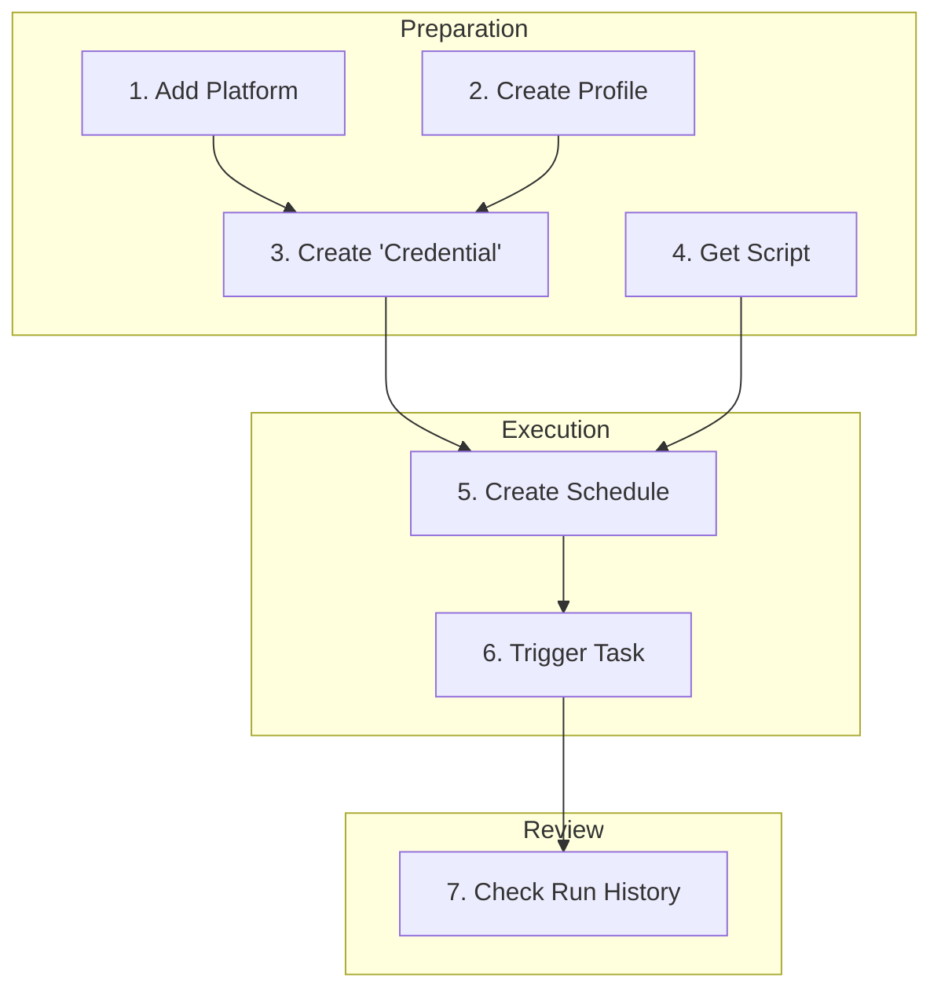

  <a href="README.md">简体中文</a> | English

  

# AnbaoAgent - Your Intelligent Desktop Automation Assistant

**Tired of tedious, repetitive computer tasks? AnbaoAgent automates any cross-browser, cross-platform workflow, freeing up your hands to focus on what truly matters.**

---

## Highlight: One-Click Publishing, Multi-Platform Sync

With just a single click, your video can be automatically published to Bilibili, Douyin, Kuaishou, Xiaohongshu, and WeChat Channels. AnbaoAgent makes content distribution unprecedentedly simple and efficient.

https://github.com/user-attachments/assets/c67c621c-eb8c-4d06-a5df-72d54d14154d

## What Can AnbaoAgent Do for You?

Whether you're a social media manager, a developer, a tester, or just looking to automate daily check-ins, AnbaoAgent is your powerful assistant.

| For Social Media Managers | For General Users | For Developers/Testers |
| :--- | :--- | :--- |
| One-Click Content Distribution | Auto Check-ins/Clock-ins | UI Regression Testing |
| Cross-Platform Data Aggregation | Scheduled Data Scraping | Website Performance Monitoring |
| Automated Account Maintenance | Auto Form Filling | Browser Compatibility Testing |

## Core Advantages

| Feature | Description |
| :--- | :--- |
| **Powerful Script Ecosystem** | Built-in script market to one-click install useful community-shared scripts. You can also upload or write your own. |
| **Isolated Multi-Account Environments** | Manage multiple accounts on different platforms with independent profiles. Login states do not interfere with each other, ensuring security and reliability. |
| **Flexible Task Scheduling** | Supports Cron expressions and manual triggers. Meets your needs for both scheduled and instant execution. |
| **Visualized Operation Logs** | Complete records of every task's run history and detailed logs, making the automation process transparent and controllable. |

## Quick Start

Start your automation journey in just a few simple steps.

1.  **Download & Install**: Download and install AnbaoAgent from [Quark Netdisk](https://pan.quark.cn/s/af71215242f3).
2.  **Configure Account**: Add a platform, create a Profile, and bind them as a Credential with a one-time login.
3.  **Get Script**: Install a script from the market or upload your own.
4.  **Create Task**: Create a scheduled task and associate it with your script and credential.
5.  **Run Task**: Trigger the task manually or let it run on schedule, then check the results in "Run History".

## Available Scripts

- [Multi-Platform Video Uploader](com.anbao.uploader/README.md)
  An automation script for multi-platform video publishing. Supports one-click publishing to multiple mainstream social media platforms, including Bilibili, Douyin, Kuaishou, Xiaohongshu, and WeChat Channels.

## Learn More

<strong>Core Concepts</strong>

- **Script**: A set of instructions for automated operations, the core of AnbaoAgent.
- **Platform**: An abstraction of the target website, such as Bilibili or Douyin.
- **Credential**: The bridge connecting a "Platform" and a "Browser Profile," representing the concept of "which account logs into which website."
- **Schedule**: Defines the complete automation flow: "when, with which account, on which website, to execute which script."

<strong>Full Feature List</strong>

### Automation Execution

- **Script Management**: Upload scripts, script market, version control, script details.
- **Task Scheduling**: Scheduled execution, manual trigger, task management, parameter configuration.
- **Run History**: Execution records, log viewing, status tracking, result analysis.

### Account Management

- **Platform Management**: Add, manage, search, and edit platforms.
- **Credential Management**: Create credentials, manage multiple accounts, search, and edit.
- **Profile Management**: Isolated environments, saved login states, data isolation, manual launch.

### Efficiency Enhancement

- **Concurrent Execution**: Run multiple tasks in parallel, resource management, concurrency control.
- **Task Dispatching**: Flexible scheduling, priority management, task queuing.
- **Resource Management**: Resource monitoring, force-release resources.

 

## Community & Support

- **User Guide**: [docs.superdaniel.cn](https://docs.superdaniel.cn)
- **Email**: superdaniel_cn@outlook.com
- **WeChat**: superdaniel_cn

 