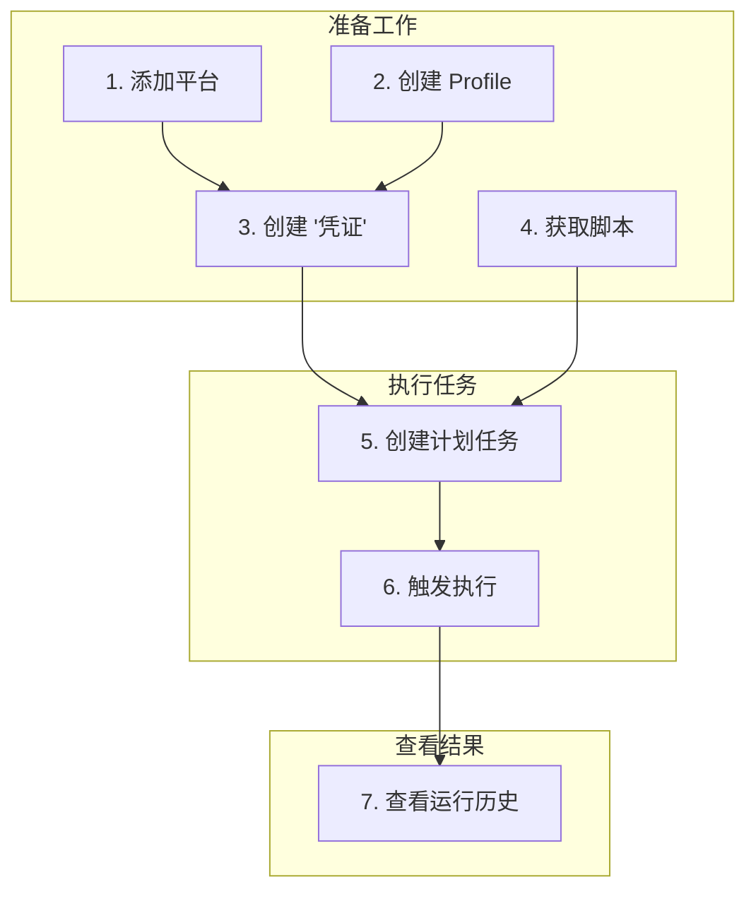

  简体中文 | <a href="README.en.md">English</a>

  

# 安宝助手 (AnbaoAgent) - 您的智能桌面自动化助理

**厌倦了繁琐的重复性电脑操作？安宝助手能将任何跨浏览器、跨平台的任务自动化，让您解放双手，专注于真正重要的事。**

---

## 亮点功能：一键发布，多平台同步

只需一次点击，您的视频就能自动发布到 B 站、抖音、快手、小红书和视频号。安宝助手让内容分发变得前所未有的简单高效。

https://github.com/user-attachments/assets/c67c621c-eb8c-4d06-a5df-72d54d14154d

## 安宝助手能为您做什么？

无论是新媒体运营、开发、测试，还是日常的自动签到，安宝助手都能成为您的得力帮手。

| 新媒体运营者   | 普通用户      | 开发/测试        |
| :------------- | :------------ | :--------------- |
| 内容一键分发   | 自动签到/打卡 | UI 回归测试      |
| 跨平台数据聚合 | 定时抓取信息  | 网站性能监控     |
| 自动化账号维护 | 自动填写表单  | 浏览器兼容性测试 |

## 核心优势

| 特性                 | 描述                                                                     |
| :------------------- | :----------------------------------------------------------------------- |
| **强大的脚本生态**   | 内置脚本市场，一键安装社区分享的实用脚本，也支持您上传或编写自己的脚本。 |
| **多账号环境隔离**   | 通过独立的 Profile 管理不同平台的多个账号，登录状态互不干扰，安全可靠。  |
| **灵活的计划任务**   | 支持 Cron 表达式和手动触发，无论是定时执行还是即时运行，都能轻松满足。   |
| **可视化的操作日志** | 完整记录每次任务的运行历史和详细日志，让自动化过程透明可控。             |

## 快速上手

只需简单几步，即可开启您的自动化之旅。

1.  **下载安装**: 从 [夸克网盘](https://pan.quark.cn/s/af71215242f3) 下载并安装安宝助手。
2.  **配置账号**: 添加平台、创建 Profile 并绑定为凭证，只需一次登录。
3.  **获取脚本**: 从脚本市场安装或上传一个您需要的脚本。
4.  **创建任务**: 创建计划任务，关联脚本和凭证。
5.  **开始执行**: 手动或定时触发任务，在“运行历史”中查看结果。

## 可用脚本

- [多平台视频上传助手](com.anbao.uploader/README.md)
  多平台视频上传自动化脚本，支持一键将视频发布到多个主流社交媒体平台。目前支持的平台有：Bilibili、抖音、快手、小红书、视频号。

## 深入了解

<strong>核心概念</strong>

- **脚本 (Script)**: 自动化操作的指令集，是安宝助手的核心。
- **平台 (Platform)**: 目标网站的抽象，如 Bilibili、抖音。
- **凭证 (Credential)**: 连接“平台”和“浏览器 Profile”的桥梁，代表了“用哪个账号登录哪个网站”。
- **计划任务 (Schedule)**: 定义“在何时、用哪个账号、在哪个网站上、执行哪个脚本”的完整自动化流程。

<strong>完整功能列表</strong>

### 自动化执行需求

- **脚本管理**: 上传脚本、脚本市场、版本管理、脚本详情
- **计划任务**: 定时执行、手动触发、任务管理、参数配置
- **运行历史**: 执行记录、日志查看、状态追踪、结果分析

### 账号管理需求

- **平台管理**: 平台添加、信息管理、搜索、编辑
- **凭证管理**: 凭证创建、多账号管理、搜索、编辑
- **Profile 管理**: 独立环境、登录状态保存、数据隔离、手动启动

### 效率提升需求

- **并发执行**: 多任务并行、资源管理、并发控制
- **任务调度**: 灵活调度、优先级管理、任务队列
- **资源管理**: 资源监控、资源释放

 

## 社区与支持

- **使用文档**: [docs.superdaniel.cn](https://docs.superdaniel.cn)
- **联系邮箱**: superdaniel_cn@outlook.com
- **微信交流**: superdaniel_cn

 
