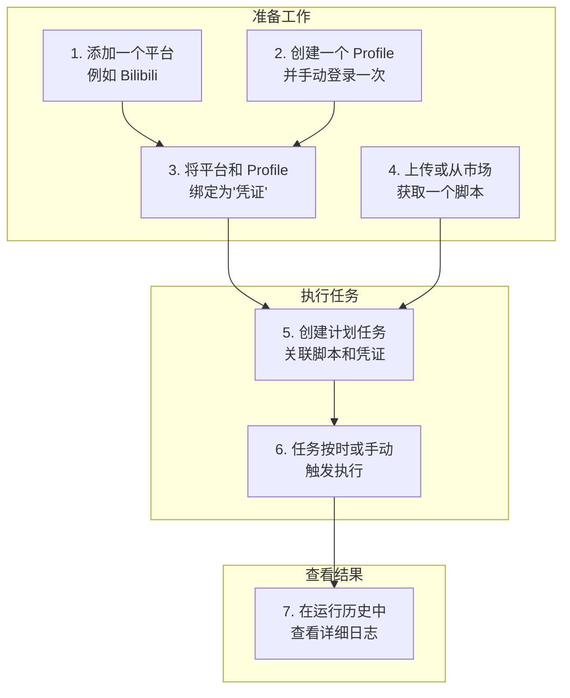

# 安宝助手 (AnbaoAgent)

安宝助手是一款强大的桌面自动化工具，它能帮助您自动执行那些需要在浏览器中重复完成的任务。简单来说，您可以找一个别人写好的操作脚本（比如"自动签到"），或者自己写一个，然后让安宝助手帮您定时、或在您需要的时候去运行它。

## 视频预览

https://github.com/user-attachments/assets/c67c621c-eb8c-4d06-a5df-72d54d14154d

## 项目简介

安宝助手的设计理念是**让自动化变得简单**。我们相信，每个人都应该能够利用自动化技术来节省时间、提高效率，而不需要具备专业的编程知识。

通过安宝助手，您可以：

- **节省时间**：将重复性的浏览器操作自动化，让您专注于更有价值的工作
- **提高效率**：24/7 不间断执行任务，无需人工干预
- **降低门槛**：无需编程知识，通过简单的配置即可实现复杂的自动化流程
- **灵活定制**：支持自定义脚本，满足各种个性化需求

无论您是普通用户、新媒体运营、测试开发工程师还是自动化爱好者，安宝助手都能为您提供合适的解决方案。

## 主要功能

### 自动化执行需求

#### 脚本管理

- **上传脚本**：支持从本地文件上传自定义脚本
- **脚本市场**：内置脚本市场，一键安装社区共享的优质脚本
- **版本管理**：支持同一脚本的多个版本
- **脚本详情**：查看脚本的详细信息和版本历史

#### 计划任务

- **定时执行**：支持标准的 Cron 表达式，灵活设置任务执行时间
- **手动触发**：随时手动启动任务，满足即时需求
- **任务管理**：创建、编辑、删除和启用/禁用任务
- **参数配置**：为任务配置启动参数，控制浏览器行为

#### 运行历史

- **执行记录**：完整记录每次任务执行的详细情况
- **日志查看**：查看任务执行的每一步日志，方便排查问题
- **状态追踪**：实时监控任务执行状态
- **结果分析**：分析任务执行结果，优化自动化流程

### 账号管理需求

#### 平台管理

- **平台添加**：添加您要进行自动化操作的目标网站
- **平台信息**：管理平台的基本信息，如名称、网址等
- **平台搜索**：快速查找已添加的平台
- **平台编辑**：随时修改平台信息

#### 凭证管理

- **凭证创建**：将平台和浏览器 Profile 绑定为凭证
- **账号管理**：管理不同网站上的多个账号身份
- **凭证搜索**：快速查找已创建的凭证
- **凭证编辑**：修改凭证的关联平台或 Profile

#### Profile 管理

- **独立环境**：每个 Profile 都是独立的浏览器环境，互不干扰
- **登录状态**：保存各网站的登录状态，实现自动登录
- **数据隔离**：不同 Profile 间的数据完全隔离，保护隐私
- **手动启动**：支持手动启动 Profile，进行临时操作

### 效率提升需求

#### 并发执行

- **多任务并行**：同时运行多个自动化任务，提高效率
- **资源管理**：智能管理系统资源，避免过度占用
- **并发控制**：可配置最大并发数，平衡性能和资源使用

#### 任务调度

- **灵活调度**：支持复杂的调度策略，满足各种业务需求
- **优先级管理**：为不同任务设置优先级，确保重要任务优先执行
- **任务队列**：智能任务队列管理，优化执行顺序

#### 资源管理

- **资源监控**：实时监控系统资源使用情况
- **资源释放**：可强制释放资源，避免资源冲突

## 适用场景

### 普通用户场景

#### 自动签到

每天自动登录各种网站完成签到任务，获取积分或奖励。无需每天手动操作，安宝助手会准时帮您完成。

#### 数据抓取

定期从网站抓取您需要的数据，如商品价格、天气预报、股票信息等。数据可以自动整理并保存到指定位置。

#### 表单填写

自动填写和提交重复性表单，如在线报名、问卷调查、信息登记等。只需配置一次，之后都能自动完成。

### 新媒体运营场景

#### 内容分发

一键将您的内容（视频、文章、图片等）发布到多个平台，如抖音、B 站、小红书等。大大节省重复发布的时间。

#### 账号维护

自动完成评论、点赞、关注等日常操作，维持账号活跃度。可以设置不同的互动策略，避免被平台识别为机器人。

#### 数据统计

自动收集各平台的数据表现，如播放量、点赞数、评论数等，并生成报表。帮助您分析内容表现，优化运营策略。

### 测试开发工程师场景

#### UI 回归测试

自动验证应用的核心流程，如登录-购物-支付等关键路径。每次发布新版后，让安宝助手自动帮您测试，确保功能正常。

#### 兼容性测试

在不同浏览器环境下自动测试网站兼容性。可以配置多种浏览器和设备组合，全面覆盖测试场景。

#### 性能监控

定期检查网站性能指标，如加载时间、响应速度等。可以设置性能阈值，当指标异常时自动报警。

### 自动化爱好者场景

#### 个人工作流

自动化个人日常工作流程，如邮件处理、文件整理、数据备份等。将重复性工作转为自动化执行，提高工作效率。

#### 数据收集

自动收集和整理网络数据，如新闻资讯、行业报告、竞品信息等。可以设置过滤条件，只收集您感兴趣的内容。

#### 任务自动化

将各种重复性任务转为自动化执行，如定时提醒、数据同步、报告生成等。让安宝助手成为您的个人助理。

## 快速上手

1. **下载并安装安宝助手**：从官方网站下载最新版本的安装包，按照提示完成安装。

2. **添加要操作的平台**：在"平台管理"中，添加您要进行自动化操作的目标网站，如 Bilibili。

3. **创建 Profile**：在"凭证管理"中，创建一个新的 Profile。

4. **将平台和 Profile 绑定为凭证**：将刚创建的 Profile 和平台绑定为凭证，方便后续使用，启动它并手动登录一次您的账号。

5. **上传或从市场获取脚本**：在"脚本管理"中，上传您自己的脚本，或从脚本市场下载一个现成的脚本。

6. **创建计划任务**：在"计划任务"中，创建一个新任务，关联好您刚才创建的脚本和凭证。

7. **运行任务并查看结果**：手动触发任务，然后在"运行历史"中观察它的执行日志和结果。

## 核心概念

### 脚本 (Script)

脚本是安宝助手的核心，它是一个包含了自动化操作指令的独立文件（bundle.js）。通过执行脚本，您可以完成例如自动发布视频、定时打卡、批量下载等各种任务。您可以从脚本市场获取脚本，也可以自己编写。

### 平台 (Platform)

平台是您要进行自动化操作的目标网站的抽象表示。例如，Bilibili、抖音、小红书都可以被定义为一个平台。平台的核心作用是与凭证进行关联，通过为平台绑定一个或多个凭证，您可以在后续创建计划任务时，快速指定在哪个平台的哪个账号上执行脚本。

### 凭证 (Credential)

凭证是连接"平台"和"浏览器 Profile"的桥梁。它代表了"用哪个账号登录哪个网站"这一核心概念。通过创建一个凭证，您可以将一个特定的"身份"（Profile）与一个"平台"关联起来，以便在后续的自动化任务中，脚本可以加载该身份对应的登录状态，实现自动登录。

### 计划任务 (Schedule)

计划任务是安宝助手的核心驱动力。它将您之前创建的平台、凭证和脚本有机地串联起来，定义了一个完整的自动化流程："在何时、用哪个账号、在哪个网站上、执行哪个脚本"。您可以设置任务定时执行，也可以手动触发执行。

## 工作流程

---

感谢您选择安宝助手！我们致力于为您提供最优质的自动化体验。如果您有任何问题或建议，欢迎随时联系我们。
