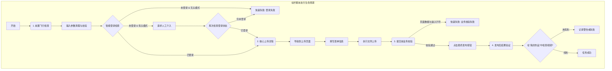

# 标杆脚本: 跨平台视频发布助手 - 架构设计

本文档阐述了“跨平台视频发布助手”脚本的架构设计，旨在打造一个健壮、可维护、可扩展的标杆级 Anbao Agent 脚本。

## 1. 核心理念

我们的架构基于三大核心理念：

1.  **关注点分离 (Separation of Concerns)**: 主入口 (`index.ts`) 只负责调度和生命周期管理。所有平台相关的具体实现都被封装在独立的、可互换的模块中。
2.  **健壮的生命周期 (Robust Lifecycle)**: 脚本的执行遵循一个严格的“前置-执行-后置”生命周期，确保在每一步都有明确的检查和验证，从而提高成功率和可预测性。
3.  **明确的契约 (Explicit Contracts)**: 所有平台模块都必须遵守一个统一的接口 (`Uploader`)，这使得添加新平台或修改现有平台变得简单和安全。

## 2. 项目结构

我们采用模块化的目录结构来组织代码：

```
com.anbao.video-uploader/
├── src/
│   ├── platforms/              # 平台专属逻辑模块
│   │   ├── bilibili.ts
│   │   ├── douyin.ts
│   │   └── ... (其他平台)
│   │
│   ├── common/                 # 通用辅助函数 (可选)
│   │   └── ...
│   │
│   ├── types.ts                # 核心类型与接口定义
│   └── index.ts                # 主入口与生命周期调度器
│
├── ARCHITECTURE.md             # 本架构文档
├── package.json                # 元数据与依赖
├── schema.json                 # 用户输入定义
└── build.js                    # 构建脚本
```

## 3. 执行生命周期

脚本的每一次运行都遵循一个标准化的生命周期，以确保其行为的稳定和可靠。



### 3.1 关键步骤详解

#### a. 前置飞行检查 (Pre-flight Check)

在执行任何核心操作之前，进行一系列检查以尽早发现问题。

-   **输入校验**: 检查 `context.common` 中的参数。例如，使用 `fs` 模块验证 `video_file_path` 是否真实存在。
-   **智能登录检查**: 这是确保脚本健壮性的核心。
    1.  调用平台模块的 `isLoggedIn()` 方法。
    2.  如果返回 `false` (未登录)，则检查运行模式：
        -   **有头模式 (`headless: false`)**: 调用 `context.requestHumanIntervention()`，弹出提示，暂停脚本，要求用户手动登录。在用户确认后，再次调用 `isLoggedIn()`。如果仍然失败，则通过 `forceExit` 终止任务。
        -   **无头模式 (`headless: true`)**: 直接调用 `context.forceExit()` 并报告“无头模式下无法自动登录”，实现快速失败。因为在此模式下，用户无法进行任何交互。

#### b. 核心上传流程 (Core Upload)

这是实际执行上传任务的阶段，包括导航、填表、上传文件等标准 Playwright 操作。

#### c. 业务校验 (Business Validation)

在点击最终“发布”按钮前，脚本会从页面上读取已填写的数据（如标题），与 `context.common` 中的原始输入进行比对。如果不匹配，则抛出 `ValidationError`，防止发布错误内容。

#### d. 发布后验证 (Post-flight Verification)

发布后，脚本会尝试导航到“我的作品”或“创作中心”等页面，通过查找新发布的视频标题来确认发布是否真正成功。这是判断任务成功的最终依据。

## 4. 错误处理模型

我们定义一个自定义错误体系，以提供比通用 `Error` 对象更丰富的上下文信息。

```typescript
// in src/types.ts
export class PlatformError extends Error {
  constructor(message: string) {
    super(message);
    this.name = 'PlatformError';
  }
}

export class LoginError extends PlatformError { /* ... */ }
export class UploadError extends PlatformError { /* ... */ }
export class ValidationError extends PlatformError { /* ... */ }
export class VerificationError extends PlatformError { /* ... */ }
```

在 `index.ts` 的主 `run` 函数中，我们会用一个 `try...catch` 块包裹整个生命周期。当捕获到 `PlatformError` 的实例时，我们就可以调用 `context.forceExit(error.message)`，向用户展示一个清晰、具体的失败原因。

## 5. 平台模块契约

所有位于 `src/platforms/` 下的平台模块，都必须导出一个实现了 `Uploader` 接口的对象。

```typescript
// in src/types.ts
import { RunOptions } from './types';

export interface Uploader {
  /**
   * 检查当前浏览器上下文中，平台是否处于登录状态。
   * @returns {Promise<boolean>} 如果已登录，返回 true。
   */
  isLoggedIn(options: RunOptions): Promise<boolean>;

  /**
   * 执行核心的上传与发布逻辑。
   * @returns {Promise<{success: boolean, url?: string}>} 返回发布结果和视频 URL。
   */
  upload(options: RunOptions): Promise<{success: boolean, url?: string}>;

  /**
   * 在发布后验证视频是否成功出现在用户的作品列表中。
   * @param videoUrl {string} - upload 方法返回的视频 URL，用于加速验证。
   * @returns {Promise<boolean>} 如果验证成功，返回 true。
   */
  verify?(options: RunOptions, videoUrl?: string): Promise<boolean>;
}
```

这个清晰的契约确保了主调度器的逻辑可以保持稳定，而所有平台特有的复杂性都被隔离在各自的模块之内。